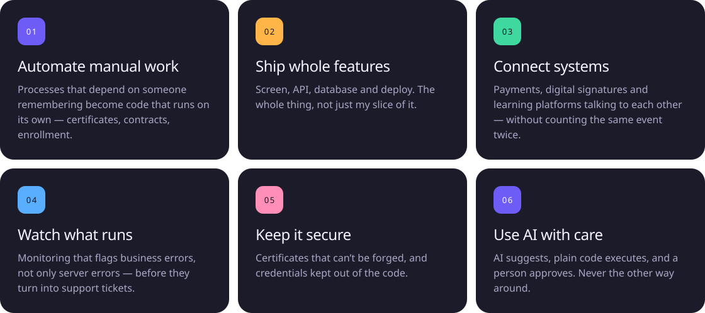
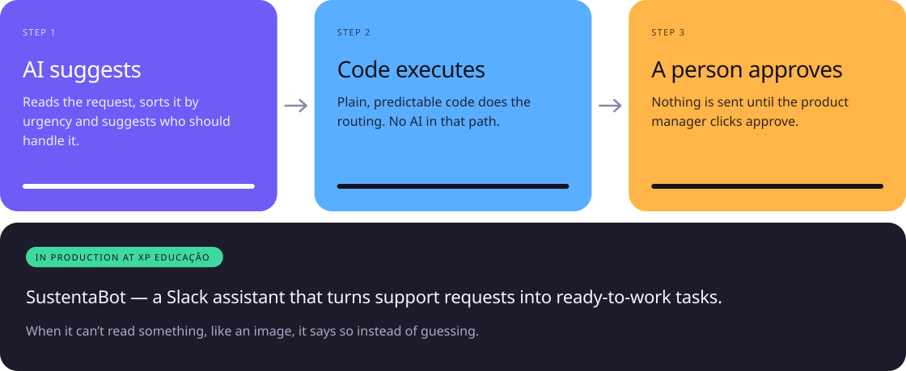

I'm a **full stack developer and Forward Deployed Engineer at XP Educação**. I work on the systems students and staff use every day — the student and professor portals, checkout, certificates and enrollment. On the side, I build and run my own apps. I study Software Engineering at PUC Minas.

### What I do

### Projects

### How I use AI

### Stack

### Let's talk

Got a system that needs to hold up under real users? Write to me — I answer in Portuguese or English.

Images generated by <code>scripts/build_assets.py</code> — edit the text in <code>scripts/content.py</code>.
