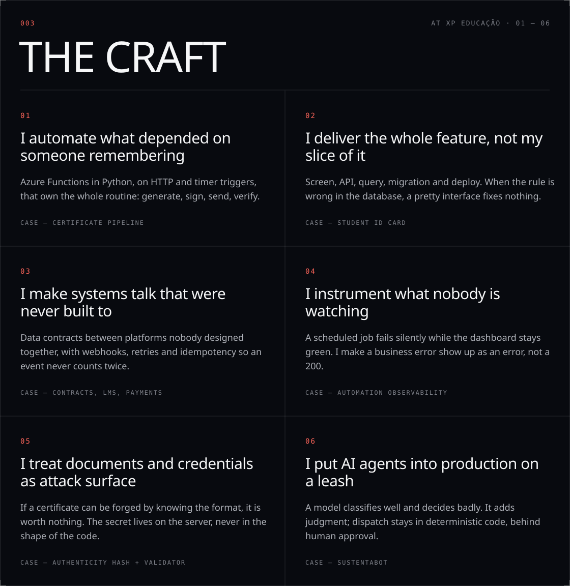
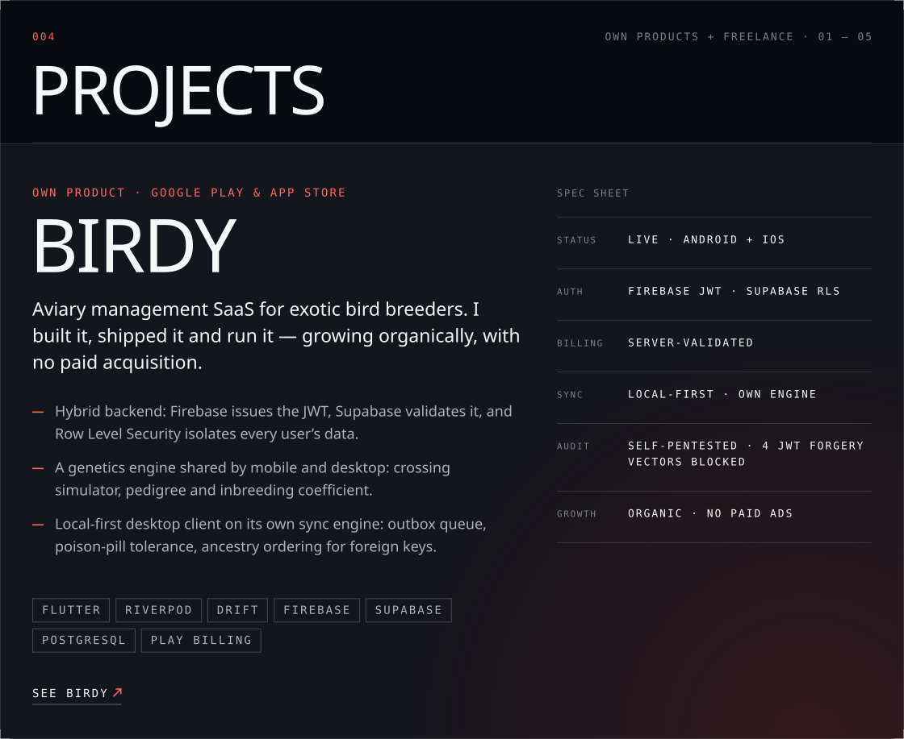
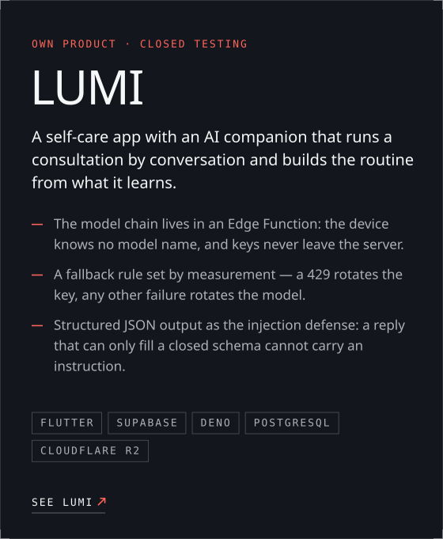
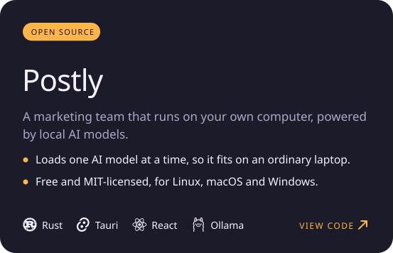
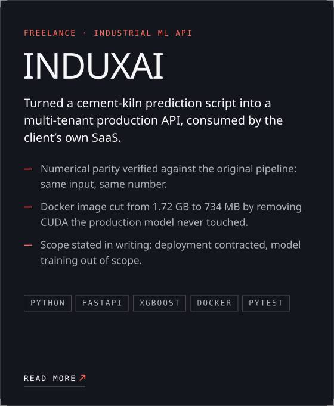
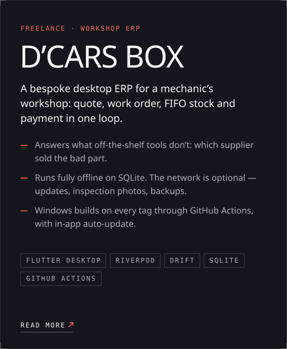
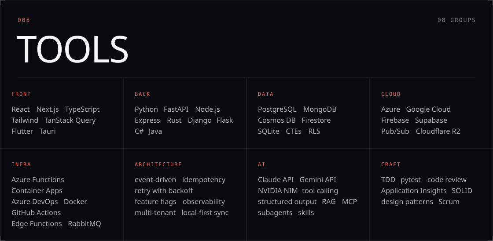
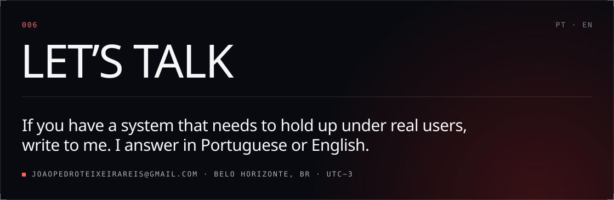

I'm a full stack developer in XP Educação's Software Engineering squad, working across most of the company's production systems: the student and professor portals, the academic core, checkout and the financial backoffice, and the serverless automations behind certificates, signed contracts and enrollment. My job is to take a process that depends on someone remembering to do it and turn it into code that runs on its own — and to answer for it when it doesn't.

Outside the squad I build and run my own products, and take the occasional contract. I study Software Engineering at PUC Minas.

&nbsp;
&nbsp;

Full case studies, in Portuguese and English, live on the <a href="https://joao-teixeira-eng.netlify.app">portfolio</a>. The images above are generated by <code>scripts/build_assets.py</code>.
